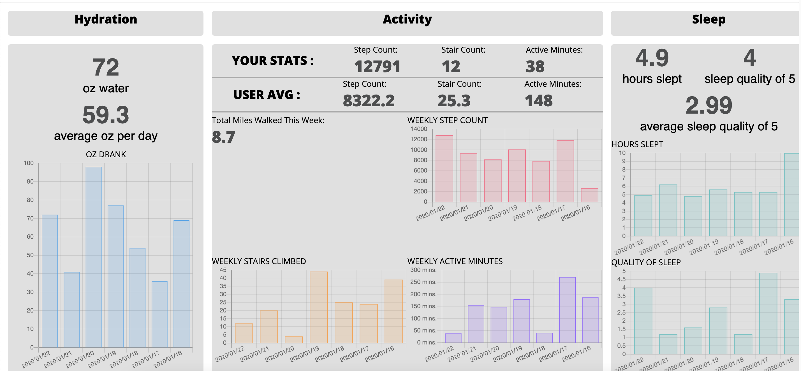

# FitLit (Refactor-Tractor)

## Introduction
_FitLit_ is a new app to help anyone begin and maintain their fitness journey.  By logging one's daily hydration, activity, and sleep habits users can keep track of their progress on the path to healthy living.

## How to use:
+ When the user first loads the page they will see a nav bar with their profile photo and several icons. Each of these icons can be clicked on to display the relevant data. Moving to the right side of the nav bar the user will notice several input fields. This is where the user can input a date and their daily stats for hydration, activity, and sleep. The user will be prompted with the type of data required for each field. If a field isn't properly filled out then an error message will display telling the user how to correct their input.

As the user scrolls down the page they will notice three sections: Hydration, Activity, and Sleep. Hydration displays the total ounces of water the user drank that day - in addition, to the average amount of ounces of water they drink daily. Further down a chart is displayed with the number of ounces the user drank that week.

The Activity section displays the user's daily stats for the number of steps walked, total flights of stairs climbed, and total number of active minutes. These stats are stacked on top of the average number of steps walked, total flights of stairs climbed, and total number of active minutes for all participants who use the app.
Under the user's daily stats there is a section that shows the total miles walked and an additional section that displays three charts. These charts show weekly data for number of steps walked, total flights of stairs climbed, and total number of active minutes.

In the Sleep section of the page the user will be shown the total number of hours they slept the night before, the quality of sleep (ranked 1-5) the user had, and the average quality of sleep they regularly get.
Under those stats there are two charts that display weekly data for the total number of hours slept and the sleep quality of each night.

When the user scrolls all the way to the bottom of the page they will notice a section with their friends' activity data. The user can compete in a friendly step challenge with their friends. At the end of each week the total number of steps are tallied up and each player is ranked by who took the most steps. The winner of the challenge is displayed on the left and the remaining participants are displayed on the right - along with their total number of steps that week.

The entire app is responsive and can be used on a desktop, laptop, table, or mobile device.

## Goals
+ Utilizing SASS for DRY, reusable styling
+ Reaching peak accessibility
+ Implementing good UXD practices

## Technologies
+ HTML
+ CSS
+ JavaScript

## Challenges and Triumphs
*Challenges:*
+ Implementing `Chart.js` library
+ GET/POST Requests
+ Getting familiar with brownfiled environments

*Triumphs:*
+ Receiving a strong accessibility score
+ Reducing layout clutter
+ Improving the application's overall performance

## Local install instructions
+ `git clone` Refactor-Tractor repository (front-end)
+ `git clone` fitlit repository (back-end API)
+ Run `npm start` in both repositories
+ Visit "http://localhost:8080/" in a browser of your choice

## Contributors
+ Katie B, https://github.com/knees4bees
+ Julia Iwinski, https://github.com/jgiwinski
+ Reggie Thompson, https://github.com/rdtho2525

### _Let's get moving!_
